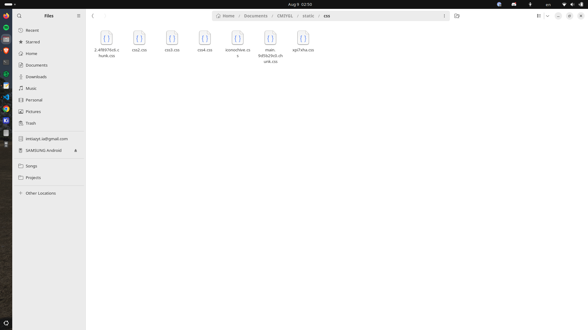
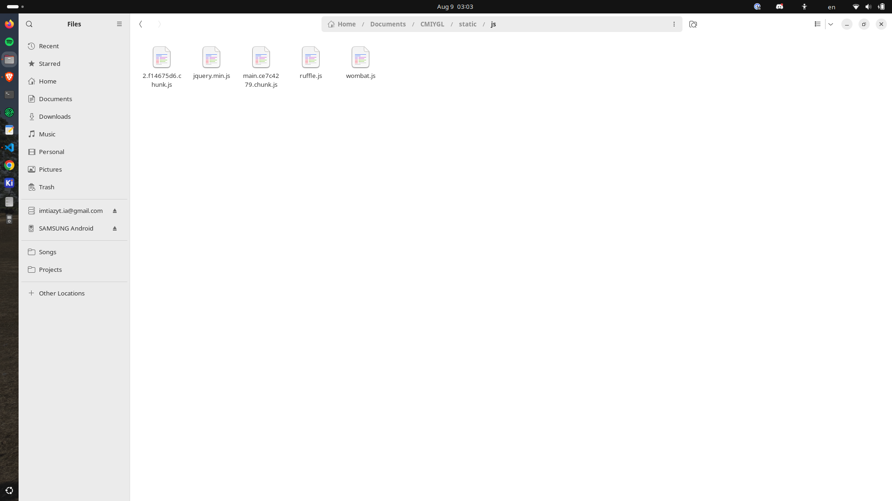

# Call Me if You Get Lost

    

## Log-1, Hackatime Coding Session: 1Hour 41Minutes

Wrote the index.html file, it basically is the bone of the design.

## Log-2, Hackatime Coding Session: 1Hour 7Minutes

And, yes. I used AI. Cause, who's gonna write all the codes, it's like 20k lines.

## Log-3, Hackatime Coding Session: 15Minutes

Wrote all the .js file, gosh now i know why they hate js so much.

## **Final**

And with that, you can finally make your own CMIYGL id.

Like this-

Check it out!

**Special Shoutout to Claude** for helping me build this project under three hours.